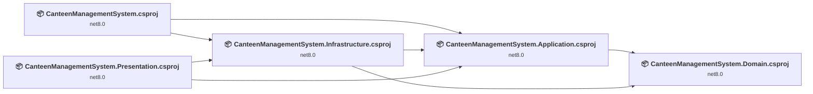
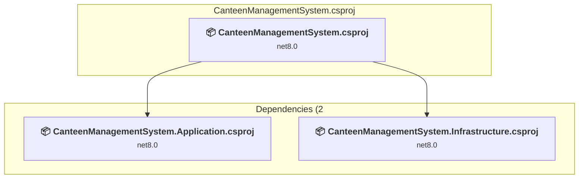
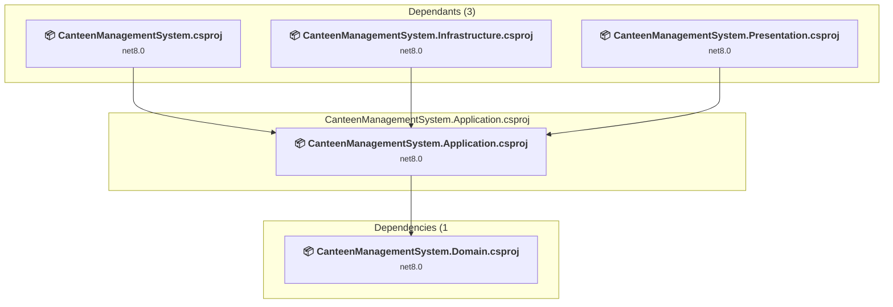
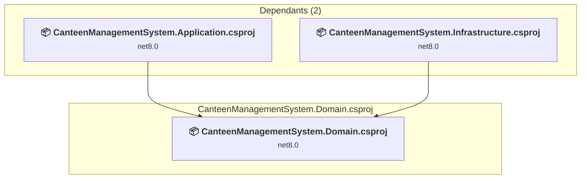
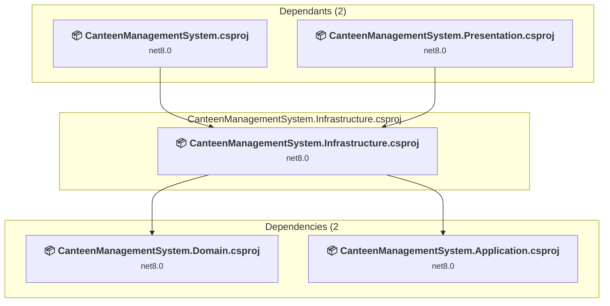
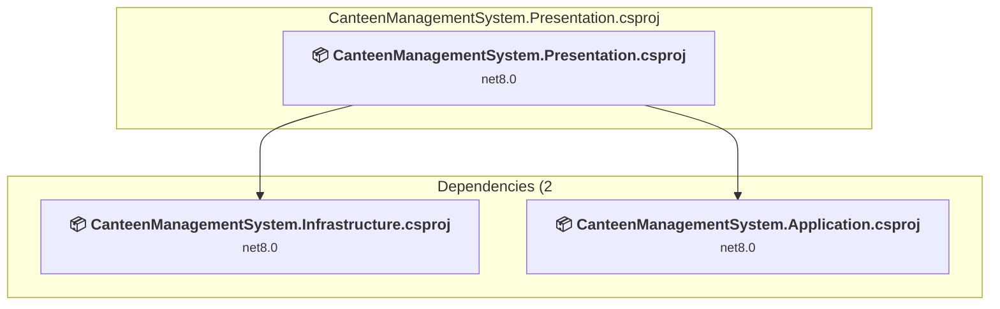

# Projects and dependencies analysis

This document provides a comprehensive overview of the projects and their dependencies in the context of upgrading to .NETCoreApp,Version=v10.0.

## Table of Contents

- [Executive Summary](#executive-Summary)
  - [Highlevel Metrics](#highlevel-metrics)
  - [Projects Compatibility](#projects-compatibility)
  - [Package Compatibility](#package-compatibility)
  - [API Compatibility](#api-compatibility)
- [Aggregate NuGet packages details](#aggregate-nuget-packages-details)
- [Top API Migration Challenges](#top-api-migration-challenges)
  - [Technologies and Features](#technologies-and-features)
  - [Most Frequent API Issues](#most-frequent-api-issues)
- [Projects Relationship Graph](#projects-relationship-graph)
- [Project Details](#project-details)

  - [CanteenManagementSystem.csproj](#canteenmanagementsystemcsproj)
  - [src\CanteenManagementSystem.Application\CanteenManagementSystem.Application.csproj](#srccanteenmanagementsystemapplicationcanteenmanagementsystemapplicationcsproj)
  - [src\CanteenManagementSystem.Domain\CanteenManagementSystem.Domain.csproj](#srccanteenmanagementsystemdomaincanteenmanagementsystemdomaincsproj)
  - [src\CanteenManagementSystem.Infrastructure\CanteenManagementSystem.Infrastructure.csproj](#srccanteenmanagementsysteminfrastructurecanteenmanagementsysteminfrastructurecsproj)
  - [src\CanteenManagementSystem.Presentation\CanteenManagementSystem.Presentation.csproj](#srccanteenmanagementsystempresentationcanteenmanagementsystempresentationcsproj)

## Executive Summary

### Highlevel Metrics

| Metric | Count | Status |
| :--- | :---: | :--- |
| Total Projects | 5 | All require upgrade |
| Total NuGet Packages | 6 | 5 need upgrade |
| Total Code Files | 77 |  |
| Total Code Files with Incidents | 10 |  |
| Total Lines of Code | 8306 |  |
| Total Number of Issues | 20 |  |
| Estimated LOC to modify | 8+ | at least 0.1% of codebase |

### Projects Compatibility

| Project | Target Framework | Difficulty | Package Issues | API Issues | Est. LOC Impact | Description |
| :--- | :---: | :---: | :---: | :---: | :---: | :--- |
| [CanteenManagementSystem.csproj](#canteenmanagementsystemcsproj) | net8.0 | 🟢 Low | 5 | 7 | 7+ | AspNetCore, Sdk Style = True |
| [src\CanteenManagementSystem.Application\CanteenManagementSystem.Application.csproj](#srccanteenmanagementsystemapplicationcanteenmanagementsystemapplicationcsproj) | net8.0 | 🟢 Low | 1 | 0 |  | ClassLibrary, Sdk Style = True |
| [src\CanteenManagementSystem.Domain\CanteenManagementSystem.Domain.csproj](#srccanteenmanagementsystemdomaincanteenmanagementsystemdomaincsproj) | net8.0 | 🟢 Low | 0 | 0 |  | ClassLibrary, Sdk Style = True |
| [src\CanteenManagementSystem.Infrastructure\CanteenManagementSystem.Infrastructure.csproj](#srccanteenmanagementsysteminfrastructurecanteenmanagementsysteminfrastructurecsproj) | net8.0 | 🟢 Low | 1 | 0 |  | ClassLibrary, Sdk Style = True |
| [src\CanteenManagementSystem.Presentation\CanteenManagementSystem.Presentation.csproj](#srccanteenmanagementsystempresentationcanteenmanagementsystempresentationcsproj) | net8.0 | 🟢 Low | 0 | 1 | 1+ | AspNetCore, Sdk Style = True |

### Package Compatibility

| Status | Count | Percentage |
| :--- | :---: | :---: |
| ✅ Compatible | 1 | 16.7% |
| ⚠️ Incompatible | 0 | 0.0% |
| 🔄 Upgrade Recommended | 5 | 83.3% |
| ***Total NuGet Packages*** | ***6*** | ***100%*** |

### API Compatibility

| Category | Count | Impact |
| :--- | :---: | :--- |
| 🔴 Binary Incompatible | 5 | High - Require code changes |
| 🟡 Source Incompatible | 1 | Medium - Needs re-compilation and potential conflicting API error fixing |
| 🔵 Behavioral change | 2 | Low - Behavioral changes that may require testing at runtime |
| ✅ Compatible | 10778 |  |
| ***Total APIs Analyzed*** | ***10786*** |  |

## Aggregate NuGet packages details

| Package | Current Version | Suggested Version | Projects | Description |
| :--- | :---: | :---: | :--- | :--- |
| BCrypt.Net-Next | 4.0.3 |  | [CanteenManagementSystem.csproj](#canteenmanagementsystemcsproj) | ✅Compatible |
| Microsoft.EntityFrameworkCore | 8.0.22 | 10.0.7 | [CanteenManagementSystem.Application.csproj](#srccanteenmanagementsystemapplicationcanteenmanagementsystemapplicationcsproj) [CanteenManagementSystem.csproj](#canteenmanagementsystemcsproj) | NuGet package upgrade is recommended |
| Microsoft.EntityFrameworkCore.Design | 8.0.22 | 10.0.7 | [CanteenManagementSystem.csproj](#canteenmanagementsystemcsproj) | NuGet package upgrade is recommended |
| Microsoft.EntityFrameworkCore.SqlServer | 8.0.22 | 10.0.7 | [CanteenManagementSystem.csproj](#canteenmanagementsystemcsproj) [CanteenManagementSystem.Infrastructure.csproj](#srccanteenmanagementsysteminfrastructurecanteenmanagementsysteminfrastructurecsproj) | NuGet package upgrade is recommended |
| Microsoft.EntityFrameworkCore.Tools | 8.0.22 | 10.0.7 | [CanteenManagementSystem.csproj](#canteenmanagementsystemcsproj) | NuGet package upgrade is recommended |
| System.Text.Encoding.CodePages | 8.0.0 | 10.0.7 | [CanteenManagementSystem.csproj](#canteenmanagementsystemcsproj) | NuGet package upgrade is recommended |

## Top API Migration Challenges

### Technologies and Features

| Technology | Issues | Percentage | Migration Path |
| :--- | :---: | :---: | :--- |

### Most Frequent API Issues

| API | Count | Percentage | Category |
| :--- | :---: | :---: | :--- |
| M:Microsoft.Extensions.Configuration.ConfigurationBinder.GetValue''1(Microsoft.Extensions.Configuration.IConfiguration,System.String) | 3 | 37.5% | Binary Incompatible |
| M:Microsoft.AspNetCore.Builder.ExceptionHandlerExtensions.UseExceptionHandler(Microsoft.AspNetCore.Builder.IApplicationBuilder,System.String) | 2 | 25.0% | Behavioral Change |
| M:Microsoft.Extensions.DependencyInjection.OptionsConfigurationServiceCollectionExtensions.Configure''1(Microsoft.Extensions.DependencyInjection.IServiceCollection,Microsoft.Extensions.Configuration.IConfiguration) | 2 | 25.0% | Binary Incompatible |
| M:System.TimeSpan.FromMinutes(System.Double) | 1 | 12.5% | Source Incompatible |

## Projects Relationship Graph

Legend:
📦 SDK-style project
⚙️ Classic project

## Project Details

### CanteenManagementSystem.csproj

#### Project Info

- **Current Target Framework:** net8.0
- **Proposed Target Framework:** net10.0
- **SDK-style**: True
- **Project Kind:** AspNetCore
- **Dependencies**: 2
- **Dependants**: 0
- **Number of Files**: 104
- **Number of Files with Incidents**: 5
- **Lines of Code**: 7994
- **Estimated LOC to modify**: 7+ (at least 0.1% of the project)

#### Dependency Graph

Legend:
📦 SDK-style project
⚙️ Classic project

### API Compatibility

| Category | Count | Impact |
| :--- | :---: | :--- |
| 🔴 Binary Incompatible | 5 | High - Require code changes |
| 🟡 Source Incompatible | 1 | Medium - Needs re-compilation and potential conflicting API error fixing |
| 🔵 Behavioral change | 1 | Low - Behavioral changes that may require testing at runtime |
| ✅ Compatible | 9626 |  |
| ***Total APIs Analyzed*** | ***9633*** |  |

### src\CanteenManagementSystem.Application\CanteenManagementSystem.Application.csproj

#### Project Info

- **Current Target Framework:** net8.0
- **Proposed Target Framework:** net10.0
- **SDK-style**: True
- **Project Kind:** ClassLibrary
- **Dependencies**: 1
- **Dependants**: 3
- **Number of Files**: 3
- **Number of Files with Incidents**: 1
- **Lines of Code**: 38
- **Estimated LOC to modify**: 0+ (at least 0.0% of the project)

#### Dependency Graph

Legend:
📦 SDK-style project
⚙️ Classic project

### API Compatibility

| Category | Count | Impact |
| :--- | :---: | :--- |
| 🔴 Binary Incompatible | 0 | High - Require code changes |
| 🟡 Source Incompatible | 0 | Medium - Needs re-compilation and potential conflicting API error fixing |
| 🔵 Behavioral change | 0 | Low - Behavioral changes that may require testing at runtime |
| ✅ Compatible | 18 |  |
| ***Total APIs Analyzed*** | ***18*** |  |

### src\CanteenManagementSystem.Domain\CanteenManagementSystem.Domain.csproj

#### Project Info

- **Current Target Framework:** net8.0
- **Proposed Target Framework:** net10.0
- **SDK-style**: True
- **Project Kind:** ClassLibrary
- **Dependencies**: 0
- **Dependants**: 2
- **Number of Files**: 0
- **Number of Files with Incidents**: 1
- **Lines of Code**: 0
- **Estimated LOC to modify**: 0+ (at least 0.0% of the project)

#### Dependency Graph

Legend:
📦 SDK-style project
⚙️ Classic project

### API Compatibility

| Category | Count | Impact |
| :--- | :---: | :--- |
| 🔴 Binary Incompatible | 0 | High - Require code changes |
| 🟡 Source Incompatible | 0 | Medium - Needs re-compilation and potential conflicting API error fixing |
| 🔵 Behavioral change | 0 | Low - Behavioral changes that may require testing at runtime |
| ✅ Compatible | 0 |  |
| ***Total APIs Analyzed*** | ***0*** |  |

### src\CanteenManagementSystem.Infrastructure\CanteenManagementSystem.Infrastructure.csproj

#### Project Info

- **Current Target Framework:** net8.0
- **Proposed Target Framework:** net10.0
- **SDK-style**: True
- **Project Kind:** ClassLibrary
- **Dependencies**: 2
- **Dependants**: 2
- **Number of Files**: 4
- **Number of Files with Incidents**: 1
- **Lines of Code**: 112
- **Estimated LOC to modify**: 0+ (at least 0.0% of the project)

#### Dependency Graph

Legend:
📦 SDK-style project
⚙️ Classic project

### API Compatibility

| Category | Count | Impact |
| :--- | :---: | :--- |
| 🔴 Binary Incompatible | 0 | High - Require code changes |
| 🟡 Source Incompatible | 0 | Medium - Needs re-compilation and potential conflicting API error fixing |
| 🔵 Behavioral change | 0 | Low - Behavioral changes that may require testing at runtime |
| ✅ Compatible | 99 |  |
| ***Total APIs Analyzed*** | ***99*** |  |

### src\CanteenManagementSystem.Presentation\CanteenManagementSystem.Presentation.csproj

#### Project Info

- **Current Target Framework:** net8.0
- **Proposed Target Framework:** net10.0
- **SDK-style**: True
- **Project Kind:** AspNetCore
- **Dependencies**: 2
- **Dependants**: 0
- **Number of Files**: 15
- **Number of Files with Incidents**: 2
- **Lines of Code**: 162
- **Estimated LOC to modify**: 1+ (at least 0.6% of the project)

#### Dependency Graph

Legend:
📦 SDK-style project
⚙️ Classic project

### API Compatibility

| Category | Count | Impact |
| :--- | :---: | :--- |
| 🔴 Binary Incompatible | 0 | High - Require code changes |
| 🟡 Source Incompatible | 0 | Medium - Needs re-compilation and potential conflicting API error fixing |
| 🔵 Behavioral change | 1 | Low - Behavioral changes that may require testing at runtime |
| ✅ Compatible | 1035 |  |
| ***Total APIs Analyzed*** | ***1036*** |  |

